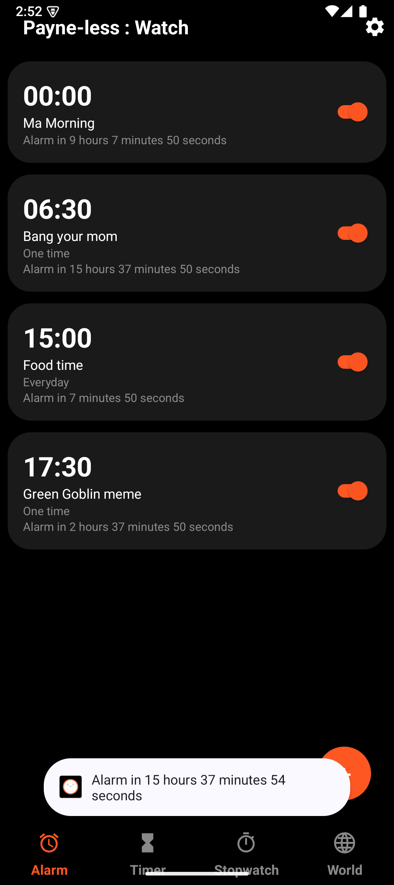
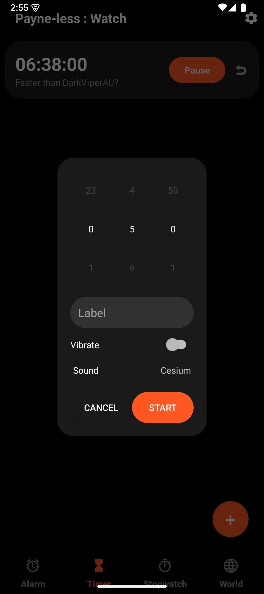
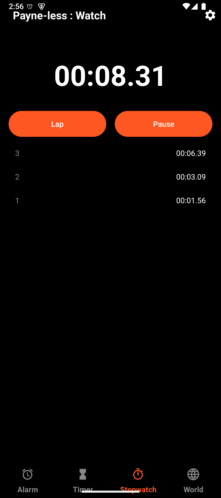
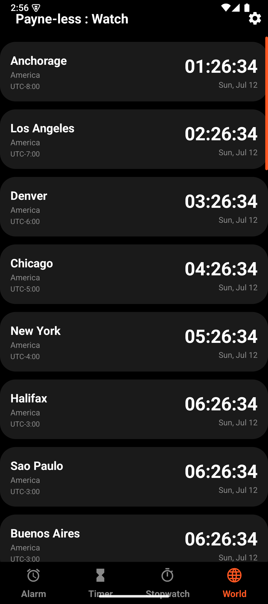
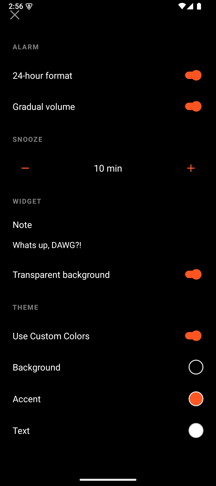
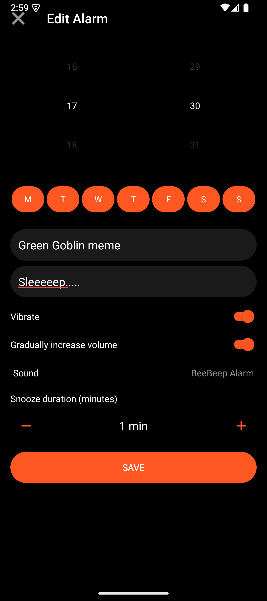
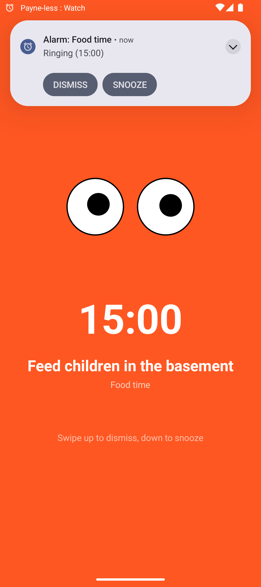

# Payne-less : Watch v1.0.0

Package: com.timely.msminutes (codename "timely")

## What this is
A lightweight customizable clock that has Alarm with Googly eyes, timer, stopwatch, and world clock tabs.

## Features

- Lightweight, 2MB post install, 25-30MB avg. RAM usage, peaks at 50-60MB, uses 10-20MB when left to run in background/cached.  (depending on OS version & Hardware, measured via PSS)
- Customizable Background, Accent and Font colors
- Switch between 12 hour and 24 hours formats
- Label and add a note to Alarms and Timers
- Notifications for Alarms, Timers & Stopwatch, with missed Alarm Notification as well!
- Has a Clock widget with transparent background and Note along with Upcoming Alarm, next timer and currently running stopwatch
- Customizable ringtones for Alarms and Timers
- Power button action selection for Alarms
- Swipe right <sub>(like it is a Tinder profile)</sub> to delete Alarm/Timer
- Full screen Alarm ring with Googly eyes that stare at your soul and wake you up in Morning
- Vibrator
- Registers directly with the AlarmManager to ensure no background RAM or battery usage <sub>(may require disabling battery optimizations for this app on some OEM skin though)</sub>
- Uses base Android components, including AppCompat, no Material based UI crap
- Can run on AOSP forks, and de-googled devices

## Getting Started

1.  **Download:** Grab the latest APK from the [Releases](https://github.com/DRAVKNOX-Studios/payne-less-watch/releases) page.
2.  **Build it:** If you're a dev, just open this in Android Studio and hit Run. It needs Android 8.0 or newer.
3.  **Setup:** Open the app once it's installed. Allow the app to send notifications <sub>and remind you're late again.</sub> 
4.  **Customize it:** The app defaults to system settings, for displaying time and theme, change it how you like!
5.  **Widget:** Add the widget to your home screen, leave a note for self, and get a glance of the upcoming alarm, next timer to run out or the stopwatch that's running.

## Screenshots

<table>
<tr>
<td align="center">
<br>
<b>First Scene</b>
</td>

<td align="center">
<br>
<b>Timer</b>
</td>

<td align="center">
<br>
<b>Stopwatch</b>
</td>

<td align="center">
<br>
<b>World Clock</b>
</td>
</tr>

<tr>
<td align="center">
<br>
<b>Settings</b>
</td>

<td align="center">
<br>
<b>Setting up an Alarm</b>
</td>

<td align="center">
<br>
<b>When an Alarm Goes off!</b>
</td>
</tr>
</table>

## Distribution

Official releases are available through:

- Google Play (Closed Testing)
- GitHub Releases
- F-Droid (planned)

The GitHub repository is the canonical source code location.

## Who This Is For

* You want a lightweight clock that doesn't eat RAM and battery or storage.
* You use a de-Googled phone, custom ROM, or privacy-focused setup.
* You appreciate software that does one job well instead of trying to become an AI assistant.

## Who This Isn't For

Payne-less: Watch might not be for you if:

* You rely heavily on AI-powered time manager.
* You want online or voice assistant integrations <sub>The latter claim is untested, it may work with voice assistants or may not.</sub>
* You want to customize every atom.
* You need 500 settings for everything.

This Clock focuses on speed, simplicity, privacy, and low resource usage first. Everything else comes second *(Spoiler: More features you care about coming soon)*.

## Privacy

Payne-less: Watch:

- Does not require internet access
- Does not send data anywhere
- Does not use analytics
- Does not use telemetry
- Does not sync data to cloud services

## Permissions

- Notifications (if granted)
- Run at startup
- Vibration
- Ask to ignore battery optimizations (this one is needed to function on some OEM Android skins unfortunately)
- Disable your lock screen/prevent phone from sleeping (needed for Alarm ringer)

## For Developers

This project is written in Kotlin with XML for views.
Only basic Android libraries are used throughout, no Material, no Proprietary or Google only libraries.

### Reproducible Builds

The application can be built directly from source using Gradle.

### Requirements

- Java 21+
- Android SDK
- Android Build Tools

### Clone

```bash
git clone https://github.com/DRAVKNOX-Studios/payne-less-watch.git
cd payne-less-watch
```

### Build Debug APK

```bash
./gradlew assembleDebug
```

### Build Release APK

```bash
./gradlew assembleRelease
```

### ANDROID SDK Configure

The Android SDK location must be configured via either:

```properties
sdk.dir=/path/to/Android/Sdk
```

**OR**

in `local.properties`,
```bash
export ANDROID_HOME=/path/to/Android/Sdk
```

### Signing

Official releases are signed by GitHub Actions.

Local builds do **not** require the project's signing key and can be built normally.

### Testing

For testing code run `./gradlew test`

### Understanding the Code

Refer to [Code Docs](code_docs.md)

### Project Structure

For Contributors, here is the [project structure](folder_structure.txt)

## Wanna Contribute?

Read [this](CONTRIBUTING.md) before opening a PR. Issues and PRs both have templates, so please fill them out rather than leaving them blank. It helps a lot.

## License

This project is brought to you by [MIT](LICENSE) LICENSE.
This LICENSE does not cover the branding name "Payne-less: Watch", refrain from using it in your forks
